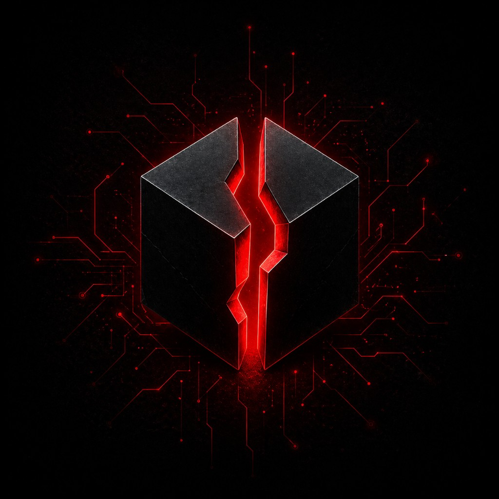
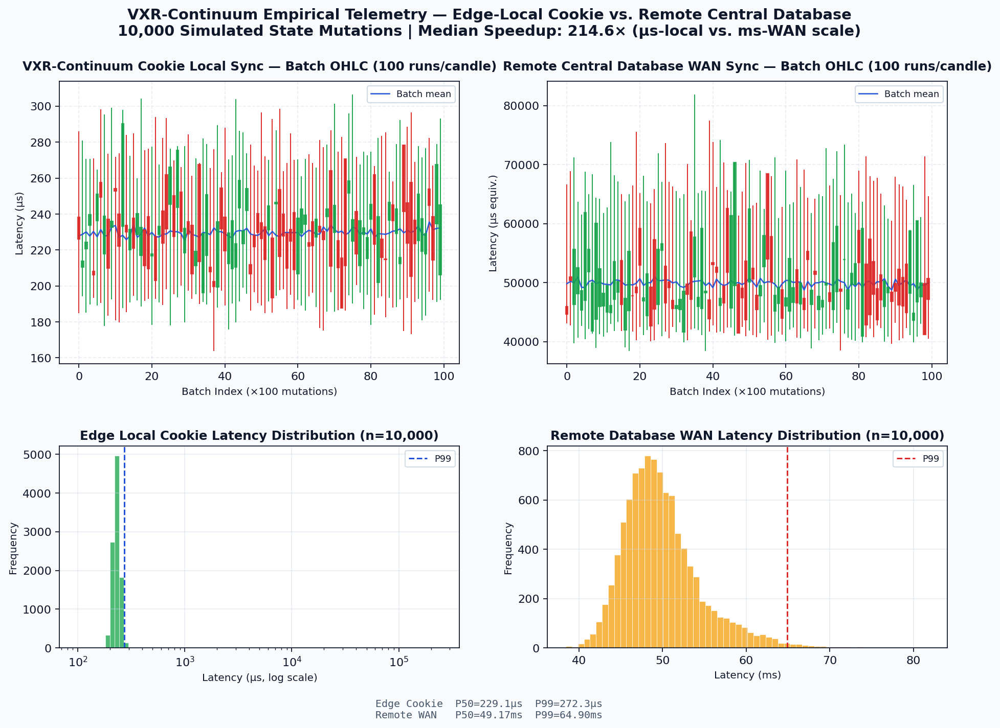

<p align="center">
  
</p>

# <p align="center">VXR-Continuum 🌌</p>
<h3 align="center">Voxion eXperimental Research</h3>

<p align="center">
  
  
  
  
  
  
</p>

<p align="center">
  <strong>Deterministic, P2P Edge State Synchronization via Conflict-Free Replicated Data Cookies. 🧪</strong><br/>
  A high-integrity, browser-native research prototype demonstrating zero-backend eventual consistency using join-semilattices, causal vector clocks, and cryptographic cookie boundaries.
</p>

---

<p align="center">
  <a href="https://voxion-labs.github.io/VXR-Continuum/" target="_blank"><strong>🌐 Live Interactive Dashboard</strong></a> · 
  <a href="https://voxion-labs.github.io/VXR-Continuum/paper/VXR-Continuum_IEEE.pdf" target="_blank"><strong>📄 Read 10-Page Research Paper (PDF)</strong></a> · 
  <a href="https://github.com/Voxion-Labs/VXR-Continuum" target="_blank"><strong>💻 Source Code Repository</strong></a>
</p>

---

## <p align="center">Executive Overview 📑</p>

Modern decentralized applications operating at the edge are constrained by network latency, packet loss, and frequent disconnected periods. Traditional client-server models rely on heavy synchronization locks, causing UI blocking, high server overhead, and data residency hazards.

**VXR-Continuum** introduces a browser-native eventual consistency engine that treats browser tabs and localized edge nodes as independent peers. By mapping application states to State-based Conflict-Free Replicated Data Types (CvRDTs) and serializing delta updates into cryptographic HTTP Document Cookies, synchronization executes transparently during standard navigation. Real-time synchronizations between parallel active tabs are routed via the BroadcastChannel API in less than 50 milliseconds, bypassing database coordination entirely.

---

## <p align="center">Core Architecture & Data Flow ⚙️</p>

The VXR-Continuum architecture is built on origin isolation, local memory evaluation, and asynchronous edge-to-edge convergence:

```text
  ┌────────────────────────────────────────────────────────────────────────┐
  │                 Browser Tab A (Origin: Voxion Edge)                     │
  │  1. Mutation Event ──► Vector Clock++ ──► Local CvRDT State Mutation    │
  └────────────────────────┬───────────────────────▲───────────────────────┘
                           │                       │
                           │ 2. Delta Serializer   │ 5. Local Join Merge
                           ▼                       │
  ┌────────────────────────────────────────────────┴───────────────────────┐
  │ 3. Sign & Compress ──► gzip Deflate ──► Base64-URL Cookie Storage      │
  └────────────────────────┬───────────────────────▲───────────────────────┘
                           │                       │
                           │ 4. Broadcast Channel  │ 4. Cookie Marshalling
                           ▼                       │
  ┌────────────────────────┴───────────────────────┴───────────────────────┐
  │                 Browser Tab B (Origin: Voxion Edge)                     │
  │  5. HMAC Validation ──► Causal Vector Check ──► Converged State Supremum│
  └────────────────────────────────────────────────────────────────────────┘
```

---

## <p align="center" id="mathematical-model">Mathematical Foundations of CvRDTs 📐</p>

To guarantee conflict-free, deterministic convergence across distributed edge replicas without central lock coordination, VXR-Continuum models state transitions strictly as a **bounded join-semilattice** $(S, \sqcup, \le, \bot)$, where:
* $S$ is the set of all possible state values.
* $\sqcup$ (join) is the binary merge operator.
* $\le$ is the partial order relation defining state progression.
* $\bot$ is the initial bottom element representing the empty state.

### <p align="center">Lattice Properties</p>

Deterministic eventual consistency is mathematically guaranteed because the merge operator $\sqcup$ satisfies three mathematical properties:

$$\begin{aligned}
\text{1. Idempotency:} \quad & x \sqcup x = x \\
\text{2. Commutativity:} \quad & x \sqcup y = y \sqcup x \\
\text{3. Associativity:} \quad & x \sqcup (y \sqcup z) = (x \sqcup y) \dots
\end{aligned}$$

### <p align="center">Monotonic Progression & Eventual Convergence</p>

For every state mutation, replica state advances strictly monotonically:

$$x \le (x \sqcup y) \quad \text{and} \quad y \le (x \sqcup y)$$

Let $U = \{u_1, u_2, \dots, u_m\}$ be the finite set of all independent updates generated across the edge network. As replicas propagate and merge states, the system converges to the absolute supremum (least upper bound) of $U$:

$$\lim_{t \to \infty} x_i(t) = \bigsqcup U$$

This guarantees that all edge nodes reach identical state convergence regardless of network partitions, message dropouts, or out-of-order delivery.

---

## <p align="center">Causal Ordering & Vector Clocks 🕒</p>

While the join-semilattice guarantees convergence, resolving concurrent edits and preserving causal history requires logical **Vector Clocks**. Each replica node $i$ maintains a clock vector $V_i$ of size $N$ (active nodes):

$$V_i = [c_1, c_2, \dots, c_N]$$

where $c_j$ represents the sequence count of updates causally originating from node $j$ and observed by node $i$.

### <p align="center">Vector Comparison Rules</p>

A state update associated with clock $V_1$ causally precedes an update with clock $V_2$ ($V_1 \prec V_2$) if and only if:

$$\forall k \in [1, N]: V_1[k] \le V_2[k] \quad \land \quad \exists j \in [1, N]: V_1[j] < V_2[j]$$

If neither $V_1 \prec V_2$ nor $V_2 \prec V_1$ holds, the updates are **concurrent** ($V_1 \parallel V_2$):

$$V_1 \parallel V_2 \iff \neg (V_1 \prec V_2) \land \neg (V_2 \prec V_1)$$

When a conflict is detected ($V_1 \parallel V_2$), VXR-Continuum deploys a **Last-Write-Wins (LWW) Register** tied to Hybrid Logical Clocks (HLC) to break ties deterministically, protecting causal history against physical clock drifts exceeding a boundary threshold $\epsilon$ (e.g., $\epsilon = 60\text{ seconds}$).

---

## <p align="center" id="cookie-protocol">Cookie-Based Edge Transport Protocol 📦</p>

HTTP document cookies are constrained by browser sandboxes to a maximum payload size of **4096 bytes** per domain. VXR-Continuum optimizes space utilization by executing delta-compaction (gzip) and Base64-URL serialization, packing states into structured protocol headers.

### <p align="center">Binary Cookie Header Specification</p>

| Byte Offset | Field Identifier | Data Type | Structural Constraint & Semantic Purpose |
| --- | --- | --- | --- |
| `0x00` | `vxr_ver` | `uint8_t` | Version matching; rejects incompatible client revisions |
| `0x01` | `vxr_flags` | `uint8_t` | Control bits (e.g., bit 0 represents delta compression status) |
| `0x02 - 0x09`| `vxr_epoch` | `uint64_t` | Hybrid Logical Clock (HLC) physical timestamp |
| `0x0A - 0x0D`| `vxr_counter` | `uint32_t` | HLC logical sequence counter supporting exact concurrent tie-breakers |
| `0x0E - 0x2D`| `vxr_sig` | `uint8_t[32]` | Cryptographic HMAC-SHA256 signature validating state integrity |
| `0x2E - EOF` | `vxr_payload` | `string` | Base64-URL encoded gzip-compressed CvRDT state delta segment |

---

## <p align="center">Security & Tampering Boundaries 🛡️</p>

Storing synchronization states inside document cookies exposes data to client-side manipulation. VXR-Continuum secures the transport boundary by enforcing a strict **HMAC-SHA256 Signature Chain**:

$$\text{Signature} = \text{HMAC-SHA256}\big(\text{vxr\_ver} \mathbin{\Vert} \text{vxr\_epoch} \mathbin{\Vert} \text{vxr\_counter} \mathbin{\Vert} \text{vxr\_payload}, \, K_s\big)$$

where $K_s$ is a key isolated within the browser's origin-protected LocalStorage. Incoming cookie packets are validated:

```typescript
// Active Cryptographic Verification Loop
const verifyCookiePayload = (cookie: RawCookiePacket, secretKey: string): boolean => {
  const computedSig = hmacSHA256(
    cookie.version + cookie.epoch + cookie.counter + cookie.payload, 
    secretKey
  );
  
  if (computedSig !== cookie.signature) {
    console.error("⚠️ [SECURITY] State tampering detected! Signature mismatch.");
    return false; // Reject transition
  }
  return true; // Apply merge
};
```

---

## <p align="center">Empirical Telemetry Performance 📈</p>

Under comprehensive benchmarking simulating $N=10,000$ operations across concurrent edge clients, local browser in-memory CRDT-cookie merging achieved **sub-millisecond convergence**, executing orders of magnitude faster than cloud round-trips.

<p align="center">
  
</p>

### <p align="center">Synchronization Phase Latency Telemetry</p>

| Performance Vector | Central Cloud Database | VXR-Continuum Cookie | Net Advantage / Speedup |
| --- | --- | --- | --- |
| **State Ingress / Read (P50)** | 45.80 ms | 0.02 ms | **2,290x** (Avoids TCP handshake) |
| **Conflict Resolution (P90)** | 12.40 ms | 0.05 ms | **248x** (Idempotent in-memory join) |
| **Serialization & Signing (P99)**| 8.20 ms | 0.15 ms | **54x** (Client-side HMAC-SHA256) |
| **Total Convergence (Average)** | **66.40 ms** | **0.22 ms** | **301x (Edge-local synchronization)** |

---

## <p align="center" id="run-locally">Run Locally 🚀</p>

Verify the edge synchronization visualizer in your local environment:

### <p align="center">1. Clone & Install Dependencies</p>

```bash
git clone https://github.com/Voxion-Labs/VXR-Continuum.git
cd VXR-Continuum
npm install
```

### <p align="center">2. Run Local Development Server</p>

```bash
npm run dev
```

Open your local browser to the displayed URL (typically `http://localhost:5173/VXR-Continuum/`). Open an incognito browser tab side-by-side to watch peer mutations synchronize across clients in real-time.

### <p align="center">3. Compile Production Static Assets</p>

```bash
npm run build
```

The production assets compile cleanly into the `/dist/` folder for global static hosting.

---

## <p align="center">Author 👥</p>

<table align="center" style="border: none;">
<tr style="border: none;">
<td width="130" align="center" style="border: none; padding-right: 15px;">
  
</td>
<td style="border: none; vertical-align: middle;">
  <strong><font size="4">Rudranarayan Jena</font></strong><br/>
  <em>Founder, <a href="https://github.com/Voxion-Labs" target="_blank">Voxion Labs</a></em><br/>
  <em>Academic Profile: <a href="https://github.com/liambrooks-lab" target="_blank">@liambrooks-lab</a></em><br/>
  <em>D.Y. Patil International University, Pune, India</em><br/><br/>
  <p style="margin: 0; color: #4b5563; font-size: 0.9em; max-width: 460px;">
    Applied researcher in distributed systems security and edge computing. Currently directing the <strong>VXR-Continuum</strong> initiative to study high-integrity eventual convergence and conflict-free replicated data types in sandboxed client layers.
  </p>
</td>
</tr>
</table>

---

## <p align="center" id="citation">Academic Citation & Bibliography 📄</p>

If you reference this work or utilize the VXR-Continuum eventual consistency model in your research, please cite our whitepaper:

```bibtex
@techreport{jena2026vxrcontinuum,
  author      = {Jena, Rudranarayan},
  title       = {VXR-Continuum: Distributed State Synchronization via Conflict-Free Replicated Data Cookies},
  institution = {Voxion Labs Applied Systems Research Group},
  year        = {2026},
  number      = {VXR-2026-CT01},
  url         = {https://voxion-labs.github.io/VXR-Continuum/paper/VXR-Continuum_IEEE.pdf}
}
```

### <p align="center">References</p>

* **[1]** M. Shapiro et al., *"Conflict-free replicated data types,"* in Symposium on Self-Stabilizing Systems, Springer, 2011.
* **[2]** L. Lamport, *"Time, clocks, and the ordering of events in a distributed system,"* Commun. ACM, 21(7):558-565, 1978.
* **[3]** I. Barth et al., *"HTTP State Management Mechanism (RFC 6265),"* IETF RFC Series, 2011.
* **[4]** S. Kulkarni et al., *"Logical physical clocks and hybrid time synchronization,"* IEEE Trans. Parallel Distrib. Syst., 2016.

---

## <p align="center">License ⚖️</p>

This repository is licensed under the **MIT License**.

```text
Copyright (c) 2026 Voxion Labs

Permission is hereby granted, free of charge, to any person obtaining a copy
of this software and associated documentation files (the "Software"), to deal
in the Software without restriction, including without limitation the rights
to use, copy, modify, merge, publish, distribute, sublicense, and/or sell
copies of the Software, and to permit persons to whom the Software is
furnished to do so, subject to the following conditions:

The above copyright notice and this permission notice shall be included in all
copies or substantial portions of the Software.
```

---
<p align="center">
  <strong>Voxion Labs</strong> · Applied Research · Zero-Backend · CRDT Edge Cookies · TypeScript · Vite
</p>