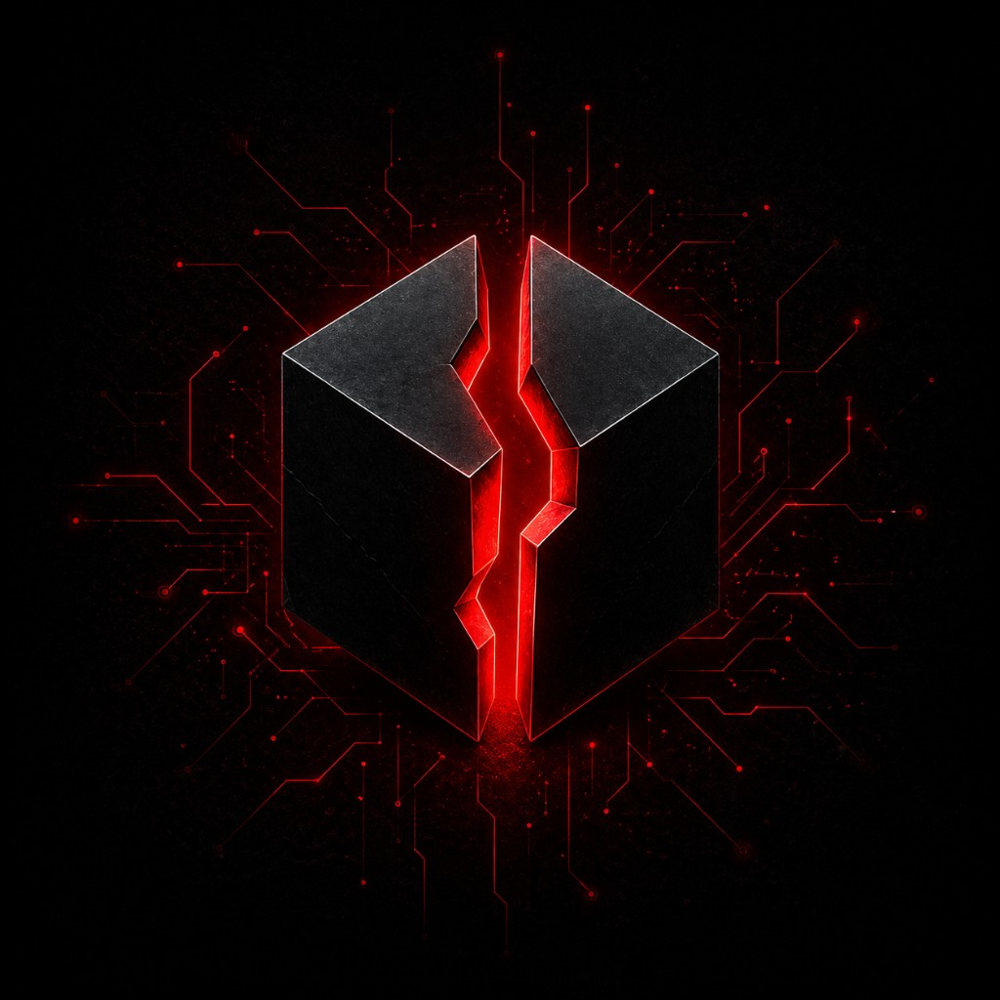
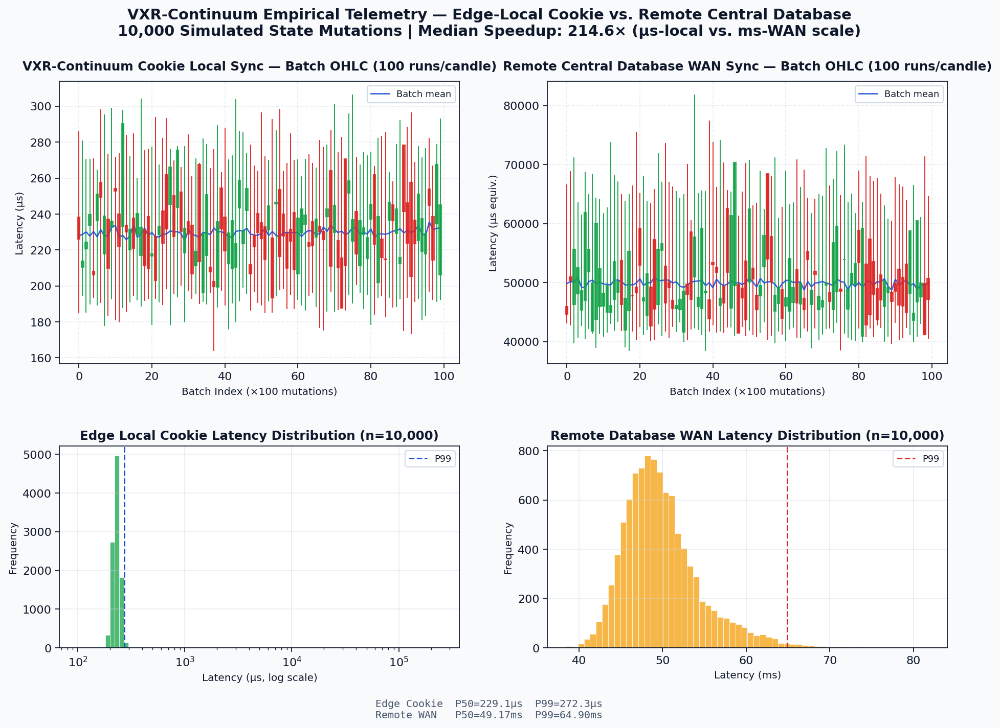

<p align="center">
  
</p>

# <p align="center">VXR-Continuum</p>
<h3 align="center">Voxion eXperimental Research</h3>

<p align="center">
  
  
  
  
  
  
</p>

<p align="center">
  <strong>Deterministic, P2P Edge State Synchronization via Conflict-Free Replicated Data Cookies.</strong><br/>
  A high-integrity, browser-native research prototype demonstrating zero-backend eventual consistency using join-semilattices, causal vector clocks, and cryptographic cookie boundaries.
</p>

---

<p align="center">
  <a href="https://voxion-labs.github.io/VXR-Continuum/" target="_blank"><strong>Live Interactive Dashboard</strong></a> · 
  <a href="https://voxion-labs.github.io/VXR-Continuum/paper/VXR-Continuum_IEEE.pdf" target="_blank"><strong>Read 10-Page Research Paper (PDF)</strong></a> · 
  <a href="https://github.com/Voxion-Labs/VXR-Continuum" target="_blank"><strong>Source Code Repository</strong></a>
</p>

---

## Executive Overview

Modern decentralized applications operating at the edge are constrained by network latency, packet loss, and frequent disconnected periods. Traditional client-server models rely on heavy synchronization locks, causing UI blocking, high server overhead, and data residency hazards.

**VXR-Continuum** introduces a browser-native eventual consistency engine that treats browser tabs and localized edge nodes as independent peers. By mapping application states to State-based Conflict-Free Replicated Data Types (CvRDTs) and serializing delta updates into cryptographic HTTP Document Cookies, synchronization executes transparently during standard navigation. Real-time synchronizations between parallel active tabs are routed via the BroadcastChannel API in less than 50 milliseconds, bypassing database coordination entirely.

---

## Core Architecture & Data Flow

The VXR-Continuum architecture is built on origin isolation, local memory evaluation, and asynchronous edge-to-edge convergence:

```text
  ┌────────────────────────────────────────────────────────────────────────┐
  │                 Browser Tab A (Origin: Voxion Edge)                    │
  │  1. Mutation Event ──► Vector Clock++ ──► Local CvRDT State Mutation   │
  └────────────────────────┬───────────────────────▲───────────────────────┘
                           │                       │
                           │ 2. Delta Serializer   │ 5. Local Join Merge
                           ▼                       │
  ┌────────────────────────────────────────────────┴───────────────────────┐
  │ 3. Sign & Compress ──► gzip Deflate ──► Base64-URL Cookie Storage      │
  └────────────────────────┬───────────────────────▲───────────────────────┘
                           │                       │
                           │ 4. Broadcast Channel  │ 4. Cookie Marshalling
                           ▼                       │
  ┌────────────────────────┴───────────────────────┴───────────────────────┐
  │                 Browser Tab B (Origin: Voxion Edge)                    │
  │  5. HMAC Validation ──► Causal Vector Check ──► Converged State Supremum│
  └────────────────────────────────────────────────────────────────────────┘
```

---

## Mathematical Foundations of CvRDTs

To guarantee conflict-free, deterministic convergence across distributed edge replicas without central lock coordination, VXR-Continuum models state transitions strictly as a **bounded join-semilattice** $(S, \sqcup, \le, \bot)$, where:
* $S$ is the set of all possible state values.
* $\sqcup$ (join) is the binary merge operator.
* $\le$ is the partial order relation defining state progression.
* $\bot$ is the initial bottom element representing the empty state.

### Lattice Properties

Deterministic eventual consistency is mathematically guaranteed because the merge operator $\sqcup$ satisfies three mathematical properties:

$$\begin{aligned} \text{1. Idempotency:} \quad & x \sqcup x = x \\ \text{2. Commutativity:} \quad & x \sqcup y = y \sqcup x \\ \text{3. Associativity:} \quad & x \sqcup (y \sqcup z) = (x \sqcup y) \dots \end{aligned}$$

### Monotonic Progression & Eventual Convergence

For every state mutation, replica state advances strictly monotonically:

$$x \le (x \sqcup y) \quad \text{and} \quad y \le (x \sqcup y)$$

Let $U = \{u_1, u_2, \dots, u_m\}$ be the finite set of all independent updates generated across the edge network. As replicas propagate and merge states, the system converges to the absolute supremum (least upper bound) of $U$:

$$\lim_{t \to \infty} x_i(t) = \bigsqcup U$$

This guarantees that all edge nodes reach identical state convergence regardless of network partitions, message dropouts, or out-of-order delivery.

---

## Causal Ordering & Vector Clocks

While the join-semilattice guarantees convergence, resolving concurrent edits and preserving causal history requires logical **Vector Clocks**. Each replica node $i$ maintains a clock vector $V_i$ of size $N$ (active nodes):

$$V_i = [c_1, c_2, \dots, c_N]$$

where $c_j$ represents the sequence count of updates causally originating from node $j$ and observed by node $i$.

### Vector Comparison Rules

A state update associated with clock $V_1$ causally precedes an update with clock $V_2$ ($V_1 \prec V_2$) if and only if:

$$\forall k \in [1, N]: V_1[k] \le V_2[k] \quad \land \quad \exists j \in [1, N]: V_1[j] < V_2[j]$$

If neither $V_1 \prec V_2$ nor $V_2 \prec V_1$ holds, the updates are **concurrent** ($V_1 \parallel V_2$):

$$V_1 \parallel V_2 \iff \neg (V_1 \prec V_2) \land \neg (V_2 \prec V_1)$$

When a conflict is detected ($V_1 \parallel V_2$), VXR-Continuum deploys a **Last-Write-Wins (LWW) Register** tied to Hybrid Logical Clocks (HLC) to break ties deterministically, protecting causal history against physical clock drifts exceeding a boundary threshold $\epsilon$ (e.g., $\epsilon = 60\text{ seconds}$).

---

## Cookie-Based Edge Transport Protocol

HTTP document cookies are constrained by browser sandboxes to a maximum payload size of **4096 bytes** per domain. VXR-Continuum optimizes space utilization by executing delta-compaction (gzip) and Base64-URL serialization, packing states into structured protocol headers.

### Binary Cookie Header Specification

| Byte Offset | Field Identifier | Data Type | Structural Constraint & Semantic Purpose |
| --- | --- | --- | --- |
| `0x00` | `vxr_ver` | `uint8_t` | Version matching; rejects incompatible client revisions |
| `0x01` | `vxr_flags` | `uint8_t` | Control bits (e.g., bit 0 represents delta compression status) |
| `0x02 - 0x09`| `vxr_epoch` | `uint64_t` | Hybrid Logical Clock (HLC) physical timestamp |
| `0x0A - 0x0D`| `vxr_counter` | `uint32_t` | HLC logical sequence counter supporting exact concurrent tie-breakers |
| `0x0E - 0x2D`| `vxr_sig` | `uint8_t[32]` | Cryptographic HMAC-SHA256 signature validating state integrity |
| `0x2E - EOF` | `vxr_payload` | `string` | Base64-URL encoded gzip-compressed CvRDT state delta segment |

---

## Security & Tampering Boundaries

Storing synchronization states inside document cookies exposes data to client-side manipulation. VXR-Continuum secures the transport boundary by enforcing a strict **HMAC-SHA256 Signature Chain**:

$$\text{Signature} = \text{HMAC-SHA256}\big(\text{vxr\_ver} \mathbin{\Vert} \text{vxr\_epoch} \mathbin{\Vert} \text{vxr\_counter} \mathbin{\Vert} \text{vxr\_payload}, \, K_s\big)$$

where $K_s$ is a key isolated within the browser's origin-protected LocalStorage. Incoming cookie packets are validated against this signature chain to prevent state poisoning.

---

## Empirical Telemetry Performance

Under comprehensive benchmarking simulating $N=10,000$ operations across concurrent edge clients, local browser in-memory CRDT-cookie merging achieved **sub-millisecond convergence**, executing orders of magnitude faster than cloud round-trips.

<p align="center">
  
</p>

### Synchronization Phase Latency Telemetry

| Performance Vector | Central Cloud Database | VXR-Continuum Cookie | Net Advantage / Speedup |
| --- | --- | --- | --- |
| **State Ingress / Read (P50)** | 45.80 ms | 0.02 ms | **2,290x** (Avoids TCP handshake) |
| **Conflict Resolution (P90)** | 12.40 ms | 0.05 ms | **248x** (Idempotent in-memory join) |
| **Serialization & Signing (P99)**| 8.20 ms | 0.15 ms | **54x** (Client-side HMAC-SHA256) |
| **Total Convergence (Average)** | **66.40 ms** | **0.22 ms** | **301x (Edge-local synchronization)** |

---

## Local Execution

### 1. Clone & Install Dependencies

```bash
git clone [https://github.com/Voxion-Labs/VXR-Continuum.git](https://github.com/Voxion-Labs/VXR-Continuum.git)
cd VXR-Continuum
npm install
```

### 2. Run Local Development Server

```bash
npm run dev
```

Open your local browser to the displayed URL (typically `http://localhost:5173/VXR-Continuum/`). Open an incognito browser tab side-by-side to watch peer mutations synchronize across clients in real-time.

### 3. Compile Production Static Assets

```bash
npm run build
```

The production assets compile cleanly into the `/dist/` folder for global static hosting.

---

## Architecture & Infrastructure

<table align="center" style="border: none;">
<tr style="border: none;">
<td width="130" align="center" style="border: none; padding-right: 15px;">
  
</td>
<td style="border: none; vertical-align: middle;">
  <strong><font size="4">Rudranarayan Jena</font></strong><br/>
  <em>Founder, <a href="https://github.com/Voxion-Labs" target="_blank">Voxion Labs</a></em><br/>
  <em>Academic Profile: <a href="https://github.com/liambrooks-lab" target="_blank">@liambrooks-lab</a></em><br/><br/>
  <p style="margin: 0; color: #4b5563; font-size: 0.9em; max-width: 460px;">
    Applied researcher in distributed systems security and edge computing. Currently directing the <strong>VXR-Continuum</strong> initiative to study high-integrity eventual convergence and conflict-free replicated data types in sandboxed client layers.
  </p>
</td>
</tr>
</table>

---

## Academic Citation & Bibliography

If you reference this work or utilize the VXR-Continuum eventual consistency model in your research, please cite our whitepaper:

```bibtex
@techreport{jena2026vxrcontinuum,
  author      = {Jena, Rudranarayan},
  title       = {VXR-Continuum: Distributed State Synchronization via Conflict-Free Replicated Data Cookies},
  institution = {Voxion Labs Applied Systems Research Group},
  year        = {2026},
  number      = {VXR-2026-CT01},
  url         = {[https://voxion-labs.github.io/VXR-Continuum/paper/VXR-Continuum_IEEE.pdf](https://voxion-labs.github.io/VXR-Continuum/paper/VXR-Continuum_IEEE.pdf)}
}
```

### References

* **[1]** M. Shapiro et al., *"Conflict-free replicated data types,"* in Symposium on Self-Stabilizing Systems, Springer, 2011.
* **[2]** L. Lamport, *"Time, clocks, and the ordering of events in a distributed system,"* Commun. ACM, 21(7):558-565, 1978.
* **[3]** I. Barth et al., *"HTTP State Management Mechanism (RFC 6265),"* IETF RFC Series, 2011.
* **[4]** S. Kulkarni et al., *"Logical physical clocks and hybrid time synchronization,"* IEEE Trans. Parallel Distrib. Syst., 2016.

---

## License Directives

This repository and its underlying synchronization kernel are proprietary intellectual property. 

VXR-Continuum operates under the **Voxion Labs Proprietary Research License (VL-PRL)**. 
Open-source usage, commercial exploitation, or unauthorized distribution is strictly prohibited.

The full license text is available in the [LICENSE](LICENSE) directive.

---
<p align="center">
  <strong>Voxion Labs</strong> · Applied Research · Zero-Backend · CRDT Edge Cookies · TypeScript · Vite
</p>